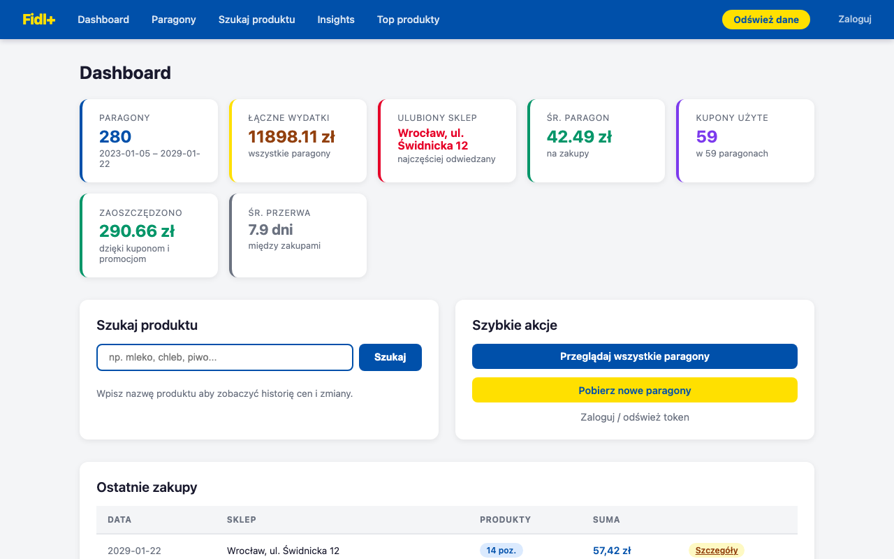
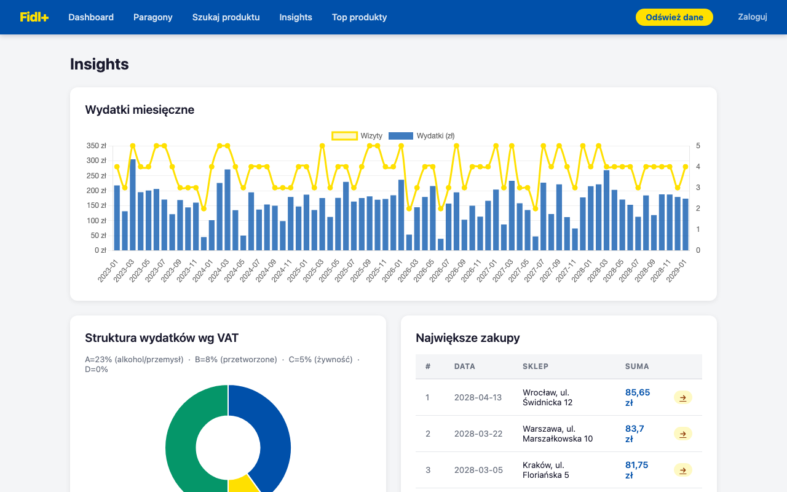
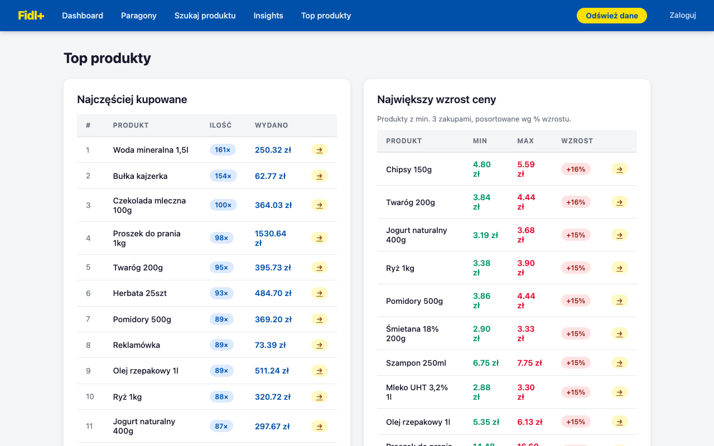
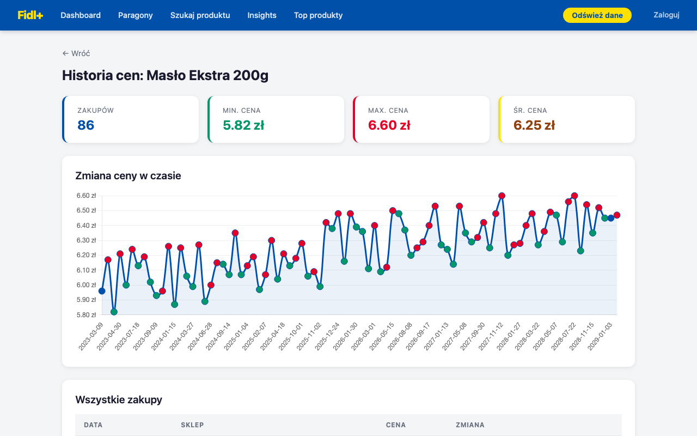
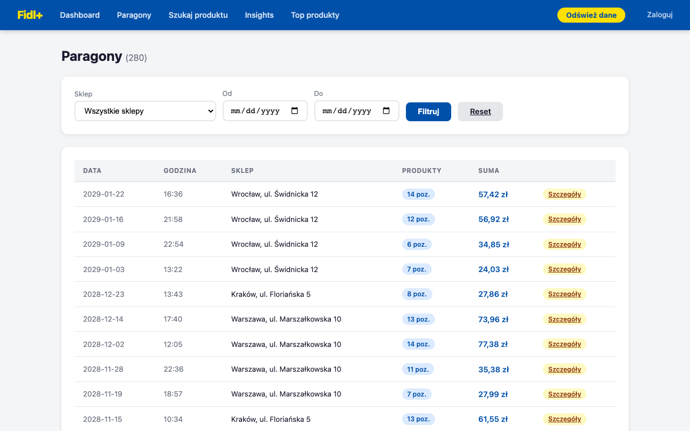
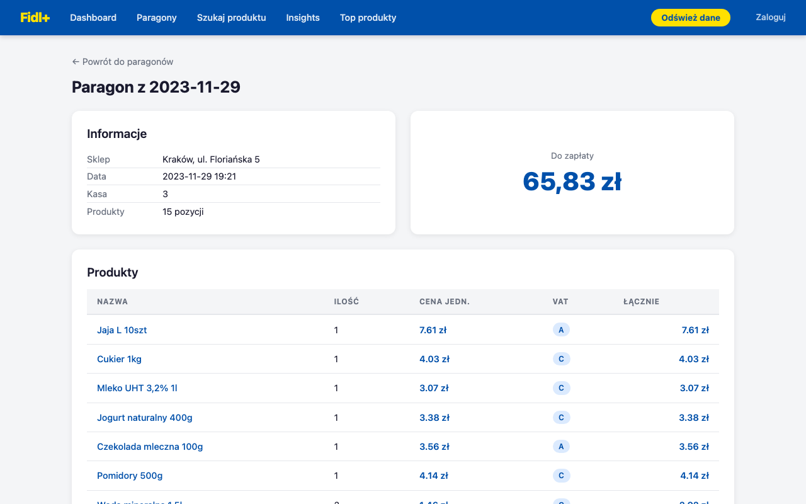

# Fidl Plus

Lokalna aplikacja webowa do przeglądania paragonów z aplikacji Lidl Plus.
Pobiera dane przez mobilne API Lidl Plus i wyświetla je w przeglądarce.

## Funkcje

- **Dashboard** – statystyki wydatków, ulubiony sklep, ostatnie zakupy
- **Lista paragonów** – wszystkie zakupy z filtrowaniem po sklepie i dacie
- **Szczegóły paragonu** – pełna lista produktów z cenami
- **Wyszukiwarka** – znajdź produkt po nazwie, zobacz ile razy kupiony
- **Historia ceny** – wykres zmiany ceny produktu w czasie
- **Normalizacja nazw** – ten sam produkt pod różnymi nazwami jest scalany po kodzie kreskowym

## Screenshoty

| Dashboard | Insights |
|---|---|
|  |  |

| Top produkty | Historia ceny |
|---|---|
|  |  |

| Paragony | Szczegóły paragonu |
|---|---|
|  |  |

## Wymagania

- Python 3.11+
- Google Chrome (do logowania)
- macOS (ścieżka do Chrome – na Linux/Windows wymaga zmiany w `browser_login.py`)

## Instalacja

```bash
git clone https://github.com/KamKubicki/fidl-plus.git
cd fidl-plus

python3 -m venv .venv
source .venv/bin/activate

pip install -r requirements.txt
playwright install chromium
```

## Użycie

### 1. Zaloguj się do Lidl Plus

```bash
python3 browser_login.py
```

Otworzy się okno Chrome z formularzem logowania Lidl Plus (Fidl Plus).
Zaloguj się ręcznie – token zostanie automatycznie przechwycony
i zapisany do `lidl_tokens.json`.

> Token jest ważny ~1 godzinę. Refresh token pozwala go odświeżyć
> przez 30 dni bez ponownego logowania.

### 2. Uruchom aplikację

```bash
python3 app.py
```

Aplikacja otworzy się automatycznie na `http://localhost:8000`.

### 3. Pobierz paragony

Wejdź na stronę `/sync` lub kliknij **Odśwież dane** w nawigacji.
Pobieranie wszystkich paragonów może potrwać kilka minut.

---

## Struktura projektu

```
├── app.py                  # Serwer FastAPI – wszystkie endpointy
├── lidl_api.py             # Klient mobilnego API Lidl Plus (OAuth2 PKCE)
├── browser_login.py        # Logowanie przez prawdziwy Chrome
├── receipt_parser.py       # Parser HTML paragonów + normalizacja nazw
├── price_analyzer.py       # Analiza zmian cen
├── templates/              # Szablony Jinja2
│   ├── base.html
│   ├── index.html
│   ├── receipts.html
│   ├── receipt_detail.html
│   ├── search.html
│   ├── product.html
│   ├── login.html
│   └── sync.html
├── requirements.txt
└── docs/
    └── screenshots/
```

## Jak działa logowanie

Lidl Plus używa **OAuth2 PKCE** z `client_id=LidlPlusNativeClient`.
Formularz logowania jest chroniony przez **reCAPTCHA Enterprise v3**,
która blokuje automatyczne requesty HTTP.

Rozwiązanie: `browser_login.py` uruchamia prawdziwy Google Chrome
przez Playwright. Przeglądarka dostaje dobry score od reCAPTCHA,
a skrypt przechwytuje deep link `com.lidlplus.app://callback?code=...`
przez event `page.on('request')` i wymienia kod na tokeny.

## Dane

Paragony są przechowywane lokalnie w `wszystkie_paragony_szczegoly.json`.
Plik nie jest commitowany do repozytorium (`.gitignore`).

API zwraca dwa formaty paragonów:
- **JSON** (`itemsLine`) – nowsze paragony, pełna struktura produktów
- **HTML** (`htmlPrintedReceipt`) – starsze paragony, `receipt_parser.py`
  parsuje je do tego samego formatu

## Technologie

- **FastAPI** + **Uvicorn** – backend
- **Jinja2** – szablony HTML
- **HTMX** – dynamiczne UI bez pisania JS
- **Chart.js** – wykresy zmian cen
- **Playwright** – logowanie przez Chrome
- **BeautifulSoup4** – parsowanie HTML paragonów
