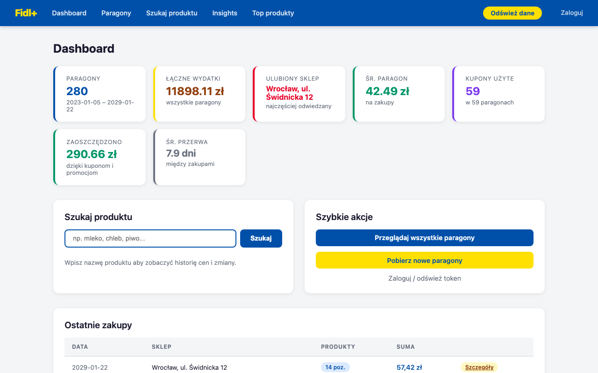
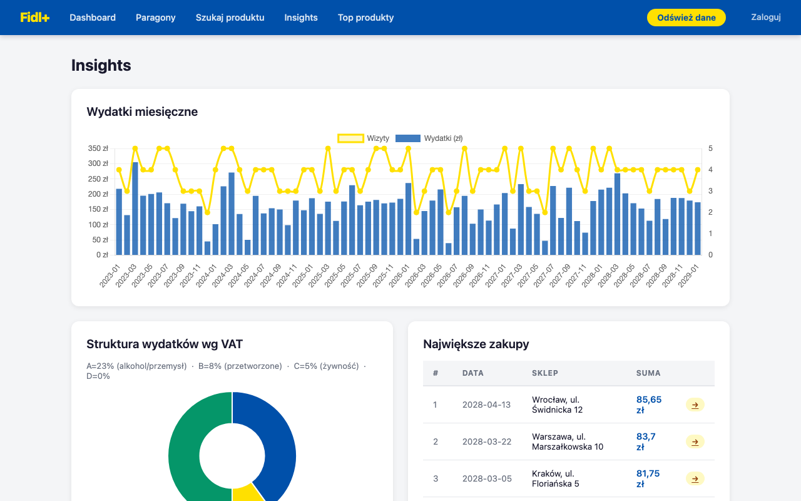
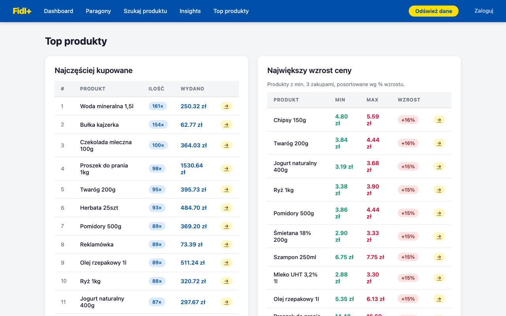
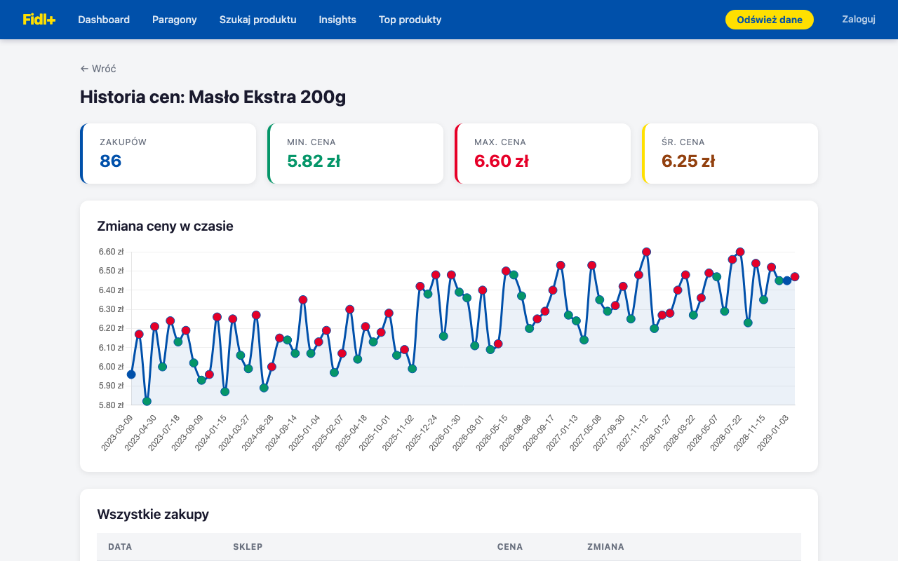
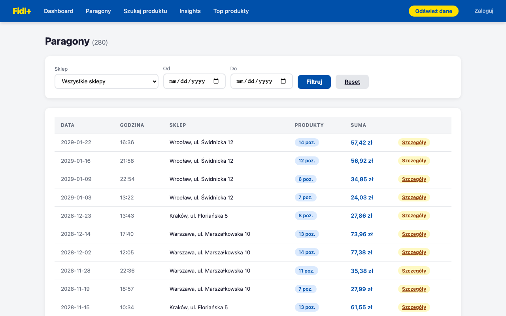
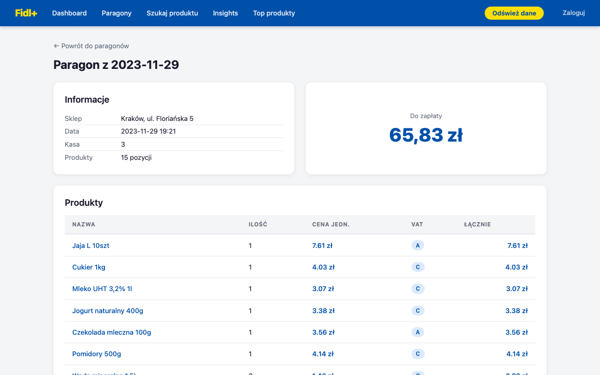

# Fidl Plus

Lokalna aplikacja webowa do przeglądania paragonów z aplikacji Lidl Plus.
Pobiera dane przez mobilne API Lidl Plus i wyświetla je w przeglądarce.

## Funkcje

- **Dashboard** – statystyki wydatków, ulubiony sklep, ostatnie zakupy
- **Lista paragonów** – wszystkie zakupy z filtrowaniem po sklepie i dacie
- **Szczegóły paragonu** – pełna lista produktów z cenami po uwzględnieniu promocji
- **Wyszukiwarka** – znajdź produkt po nazwie, zobacz ile razy kupiony
- **Historia ceny** – wykres zmiany ceny produktu w czasie (ceny efektywne po rabatach)
- **Normalizacja nazw** – ten sam produkt pod różnymi nazwami jest scalany po kodzie kreskowym

## Screenshoty

| Dashboard | Insights |
|---|---|
|  |  |

| Top produkty | Historia ceny |
|---|---|
|  |  |

| Paragony | Szczegóły paragonu |
|---|---|
|  |  |

## Wymagania

### Instalacja lokalna (z Chrome)
- Python 3.11+
- Google Chrome (do logowania)
- macOS (ścieżka do Chrome – na Linux/Windows wymaga zmiany w `browser_login.py`)

### Instalacja przez Docker (Synology, homelab, serwer)
- Docker + Docker Compose

---

## Instalacja lokalna

```bash
git clone https://github.com/KamKubicki/fidl-plus.git
cd fidl-plus

python3 -m venv .venv
source .venv/bin/activate

pip install -r requirements.txt
playwright install chromium
```

## Użycie (instalacja lokalna)

### 1. Zaloguj się do Lidl Plus

```bash
python3 browser_login.py
```

Otworzy się okno Chrome z formularzem logowania Lidl Plus.
Zaloguj się ręcznie – token zostanie automatycznie przechwycony
i zapisany do `lidl_tokens.json`.

> Token jest ważny ~1 godzinę. Refresh token pozwala go odświeżyć
> przez 30 dni bez ponownego logowania.

### 2. Uruchom aplikację

```bash
python3 app.py
```

Aplikacja otworzy się automatycznie na `http://localhost:8000`.

### 3. Pobierz paragony

Wejdź na stronę `/sync` lub kliknij **Odśwież dane** w nawigacji.
Pobieranie wszystkich paragonów może potrwać kilka minut.

---

## Instalacja przez Docker (Synology NAS, homelab, serwer bez GUI)

### Krok 1: Uruchom kontener

Na serwerze (Synology, homelab, itp.):

```bash
git clone https://github.com/KamKubicki/fidl-plus.git
cd fidl-plus
mkdir -p data
docker compose up -d
```

Aplikacja będzie dostępna pod `http://<adres-serwera>:8000`.

### Krok 2: logowanie


### Krok 4: Pobierz paragony

Wejdź na `/sync` i uruchom pobieranie. Dane są zapisywane
w `./data/` na hoście (volume), więc przetrwają restart kontenera.

### Aktualizacja tokenów

Refresh token jest ważny 30 dni. Aplikacja automatycznie go odświeża
przy każdej synchronizacji.

### Zmiana portu

Aby zmienić port (np. na 8080), edytuj `docker-compose.yml`:

```yaml
ports:
  - "8080:8000"
```

### Synology DSM – Container Manager

1. Otwórz **Container Manager** → **Project** → **Create**
2. Wskaż katalog z plikami projektu (w tym `docker-compose.yml`)
3. Upewnij się że katalog `data` istnieje na NAS
4. Uruchom projekt

Alternatywnie możesz użyć obrazu bezpośrednio:

```bash
docker run -d \
  --name fidl-plus \
  --restart unless-stopped \
  -p 8000:8000 \
  -v /volume1/docker/fidl-plus/data:/data \
  fidl-plus
```

---

## Struktura projektu

```
├── app.py                  # Serwer FastAPI – wszystkie endpointy
├── lidl_api.py             # Klient mobilnego API Lidl Plus (OAuth2 PKCE)
├── browser_login.py        # Logowanie przez prawdziwy Chrome
├── receipt_parser.py       # Parser HTML paragonów + normalizacja nazw
├── price_analyzer.py       # Analiza zmian cen
├── Dockerfile              # Obraz Docker
├── docker-compose.yml      # Docker Compose
├── templates/              # Szablony Jinja2
│   ├── base.html
│   ├── index.html
│   ├── receipts.html
│   ├── receipt_detail.html
│   ├── search.html
│   ├── product.html
│   ├── login.html
│   └── sync.html
├── requirements.txt
└── docs/
    └── screenshots/
```

## Jak działa logowanie

Lidl Plus używa **OAuth2 PKCE** z `client_id=LidlPlusNativeClient`.
Formularz logowania jest chroniony przez **reCAPTCHA Enterprise v3**,
która blokuje automatyczne requesty HTTP.

Rozwiązanie: `browser_login.py` uruchamia prawdziwy Google Chrome
przez Playwright. Przeglądarka dostaje dobry score od reCAPTCHA,
a skrypt przechwytuje deep link `com.lidlplus.app://callback?code=...`
przez event `page.on('request')` i wymienia kod na tokeny.

## Dane i promocje

Paragony są przechowywane lokalnie w `data/wszystkie_paragony_szczegoly.json`
(przy Docker) lub `wszystkie_paragony_szczegoly.json` (lokalnie).
Plik nie jest commitowany do repozytorium (`.gitignore`).

Wszystkie statystyki (wydatki, historia cen, ranking produktów) uwzględniają
**naliczone promocje** – ceny są obliczane po odliczeniu rabatów z pola
`discounts` każdej pozycji. W widoku szczegółów paragonu przekreślona
cena oznacza cenę przed rabatem.

API zwraca dwa formaty paragonów:
- **JSON** (`itemsLine`) – nowsze paragony, pełna struktura produktów
- **HTML** (`htmlPrintedReceipt`) – starsze paragony, `receipt_parser.py`
  parsuje je do tego samego formatu

## Technologie

- **FastAPI** + **Uvicorn** – backend
- **Jinja2** – szablony HTML
- **HTMX** – dynamiczne UI bez pisania JS
- **Chart.js** – wykresy zmian cen
- **Playwright** – logowanie przez Chrome
- **BeautifulSoup4** – parsowanie HTML paragonów
- **Docker** – konteneryzacja dla home lab / NAS


## Funkcje

- **Dashboard** – statystyki wydatków, ulubiony sklep, ostatnie zakupy
- **Lista paragonów** – wszystkie zakupy z filtrowaniem po sklepie i dacie
- **Szczegóły paragonu** – pełna lista produktów z cenami
- **Wyszukiwarka** – znajdź produkt po nazwie, zobacz ile razy kupiony
- **Historia ceny** – wykres zmiany ceny produktu w czasie
- **Normalizacja nazw** – ten sam produkt pod różnymi nazwami jest scalany po kodzie kreskowym

## Screenshoty

| Dashboard | Insights |
|---|---|
|  |  |

| Top produkty | Historia ceny |
|---|---|
|  |  |

| Paragony | Szczegóły paragonu |
|---|---|
|  |  |

## Uruchomienie w Dockerze (zalecane)

Działa na dowolnym systemie – nie wymaga Chrome ani Pythona na hoście.

```bash
git clone https://github.com/KamKubicki/fidl-plus.git
cd fidl-plus
docker compose up -d
```

Wejdź na `http://localhost:8000/login` i kliknij **Zaloguj się**.
Otworzy się druga karta z podglądem przeglądarki uruchomionej w kontenerze
(noVNC, port 6080) – zaloguj się tam ręcznie do Lidl Plus. Token zostanie
przechwycony automatycznie i zapisany w `./data/lidl_tokens.json`.

Następnie kliknij **Odśwież dane**, żeby pobrać paragony.

Zmienne środowiskowe:

| Zmienna | Domyślnie | Opis |
|---|---|---|
| `DATA_DIR` | `/data` | katalog na tokeny i paragony |
| `NOVNC_PORT` | `6080` | port podglądu przeglądarki |
| `NOVNC_URL` | – | pełny adres noVNC, gdy stoisz za reverse proxy |
| `LOGIN_TIMEOUT` | `180` | ile sekund czekać na zalogowanie |

---

## Instalacja lokalna (bez Dockera)

### Wymagania

- Python 3.11+
- Google Chrome (macOS) lub Chromium (Linux) – do logowania

### Instalacja

```bash
git clone https://github.com/KamKubicki/fidl-plus.git
cd fidl-plus

python3 -m venv .venv
source .venv/bin/activate

pip install -r requirements.txt
```

Na macOS używana jest domyślna ścieżka do Google Chrome. Na innych systemach
albo przy nietypowej lokalizacji wskaż binarkę zmienną `CHROME_BINARY`:

```bash
export CHROME_BINARY=/usr/bin/chromium
```

## Użycie

### 1. Zaloguj się do Lidl Plus

```bash
python3 browser_login.py
```

Otworzy się okno Chrome z formularzem logowania Lidl Plus (Fidl Plus).
Zaloguj się ręcznie – token zostanie automatycznie przechwycony
i zapisany do `data/lidl_tokens.json`.

> Token jest ważny ~1 godzinę. Refresh token pozwala go odświeżyć
> przez 30 dni bez ponownego logowania.

### 2. Uruchom aplikację

```bash
python3 app.py
```

Aplikacja otworzy się automatycznie na `http://localhost:8000`.

### 3. Pobierz paragony

Wejdź na stronę `/sync` lub kliknij **Odśwież dane** w nawigacji.
Pobieranie wszystkich paragonów może potrwać kilka minut.

---

## Struktura projektu

```
├── app.py                  # Serwer FastAPI – wszystkie endpointy
├── lidl_api.py             # Klient mobilnego API Lidl Plus (OAuth2 PKCE)
├── browser_login.py        # Logowanie przez prawdziwy Chrome/Chromium
├── receipt_parser.py       # Parser HTML paragonów + normalizacja nazw
├── price_analyzer.py       # Analiza zmian cen
├── Dockerfile              # Chromium + Xvfb + noVNC + aplikacja
├── docker-compose.yml
├── docker-entrypoint.sh    # Start Xvfb / x11vnc / noVNC / uvicorn
├── lidl-callback-handler   # Handler schematu com.lidlplus.app://
├── templates/              # Szablony Jinja2
│   ├── base.html
│   ├── index.html
│   ├── receipts.html
│   ├── receipt_detail.html
│   ├── receipt_print.html
│   ├── search.html
│   ├── product.html
│   ├── login.html
│   └── sync.html
├── requirements.txt
├── data/                   # Tokeny i pobrane paragony (poza repozytorium)
└── docs/
    └── screenshots/
```

## Jak działa logowanie

Lidl Plus używa **OAuth2 PKCE** z `client_id=LidlPlusNativeClient`.
Formularz logowania jest chroniony przez **reCAPTCHA Enterprise v3**,
która blokuje automatyczne requesty HTTP.

Rozwiązanie: `browser_login.py` uruchamia prawdziwą przeglądarkę przez
Playwright – dostaje ona dobry score od reCAPTCHA. Po zalogowaniu Lidl
przekierowuje na deep link `com.lidlplus.app://callback?code=...`, który
przechwytujemy trzema drogami:

1. **CDP** (`Network.requestWillBeSent`) – widzi też przekierowania 302
   na custom scheme, których Playwright czasem nie raportuje,
2. zdarzenia Playwright – `request`, `framenavigated`, `popup`,
3. **handler `xdg-open`** – system oddaje URL skryptowi
   `lidl-callback-handler`, który zapisuje go do pliku (Linux/Docker).

Kod jest następnie wymieniany na tokeny.

## Ceny i rabaty

Paragony rozróżniają dwie ceny:

- **cena podstawowa** – `currentUnitPrice`, cena regularna z półki,
- **cena promocyjna** – kwota faktycznie zapłacona, po odliczeniu kuponów
  Lidl Plus.

Statystyki, wykresy i rankingi liczone są na cenach promocyjnych.

> `totalAmount` zwracane przez API jest już **po** odliczeniu rabatów –
> `totalDiscount` służy tylko do pokazania, ile zaoszczędzono.

## Dane

Paragony i tokeny są przechowywane lokalnie w katalogu `data/`
(konfigurowalnym przez `DATA_DIR`). Katalog nie jest commitowany
do repozytorium (`.gitignore`).

API zwraca dwa formaty paragonów:
- **JSON** (`itemsLine`) – nowsze paragony, pełna struktura produktów
- **HTML** (`htmlPrintedReceipt`) – starsze paragony, `receipt_parser.py`
  parsuje je do tego samego formatu, razem z liniami rabatów

## Technologie

- **FastAPI** + **Uvicorn** – backend
- **Jinja2** – szablony HTML
- **HTMX** – dynamiczne UI bez pisania JS
- **Chart.js** – wykresy zmian cen
- **Playwright** – logowanie przez Chrome/Chromium
- **BeautifulSoup4** – parsowanie HTML paragonów
- **Xvfb + noVNC** – podgląd okna przeglądarki w Dockerze
